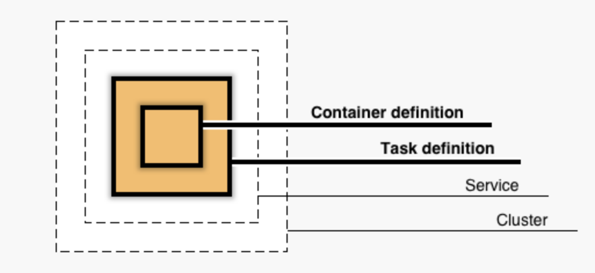

# ECS Overview

In this article, the goal is to describe common concepts that we are using in UCO SDLC (software development lifecycle) in projects.

    

## Terminology
Continuous Delivery: A software development practice in which code changes are automatically built, tested, and prepared for a release to production.

Continuous Integration: A software development practice in which developers regularly merge code changes into a central repository, after which automated builds and tests are run.

REST: Representational state transfer. A simple stateless architecture that generally runs over HTTPS/TLS. REST emphasizes that resources have unique and hierarchical identifiers (URIs), are represented by common media types (HTML, XML, JSON, and so on), and that operations on the resources are either predefined or discoverable within the media type. In practice, this generally results in a limited number of operations.

RESTful web service: Also known as RESTful API. A web service that follows REST architectural constraints. The API operations must use HTTP methods explicitly; expose hierarchical URIs; and transfer either XML, JSON, or both.

Batch Prediction: Amazon Machine Learning: An operation that processes multiple input data observations at one time (asynchronously). Unlike real-time predictions, batch predictions are not available until all predictions have been processed.

Task Definition: The blueprint for your task. Specifies the name of the task, revisions, container definitions, and volume information.

Task: An instantiation of a task definition that is running on a container instance.

Cluster:  A logical grouping of container instances that you can place tasks on.

Container: A Linux container that was created from a Docker image as part of a task.

Container Definition: Specifies which Docker image to use for a container, how much CPU and memory the container is allocated, and more options. The container definition is included as part of a task definition.

Container Instance: An EC2 instance that is running the Amazon Elastic Container Service (Amazon ECS) agent and has been registered into a cluster. Amazon ECS tasks are placed on active container instances.

Load Balancer: A DNS name combined with a set of ports, which together provide a destination for all requests intended for your application. A load balancer can distribute traffic to multiple application instances across every Availability Zone within a Region. Load balancers can span multiple Availability Zones within an AWS Region into which an Amazon EC2 instance was launched. But load balancers cannot span multiple Regions.

Target Group: Each target group is used to route requests to one or more registered targets. When you create a listener, you specify a target group for its default action. Traffic is forwarded to the target group specified in the listener rule. You can create different target groups for different types of requests. For example, create one target group for general requests and other target groups for requests to the microservices for your application.

## References
- ECS Glossary: https://docs.aws.amazon.com/AmazonECS/latest/developerguide
- Continuous Integration: https://aws.amazon.com/devops/continuous-integration/
- Continuous Deployment: https://aws.amazon.com/devops/continuous-delivery/
- ELB Target Group: https://docs.aws.amazon.com/elasticloadbalancing/latest/network/load-balancer-target-groups.html