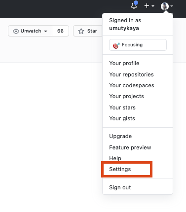
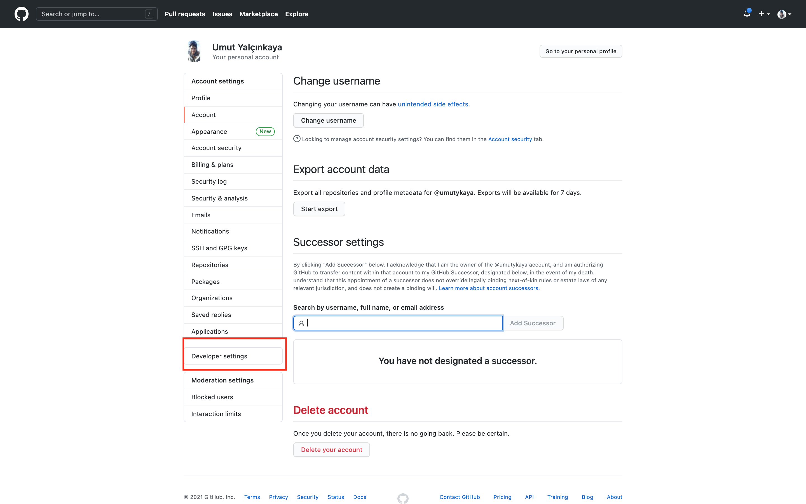
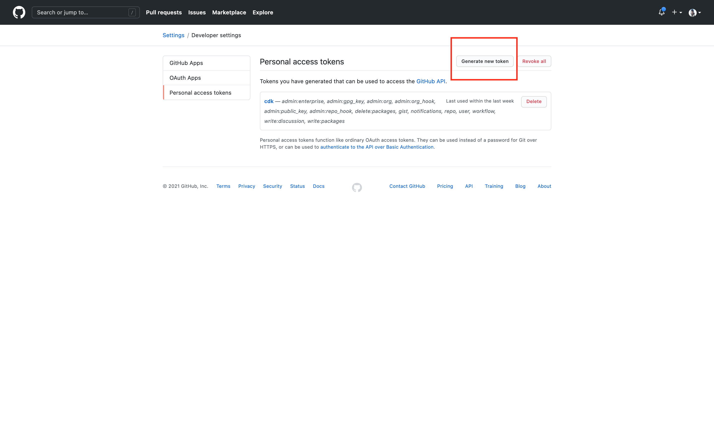
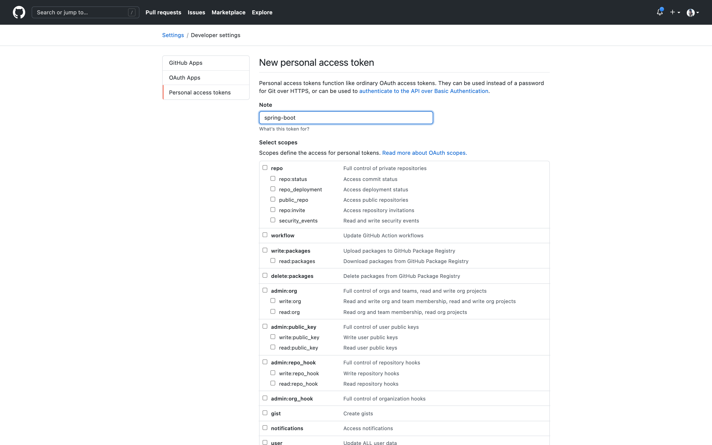

# Github Token

In this part of documentation you can find how to create github token.

1) Open up settings page.
 

    

2) Click developer token.
 

    

3) Generate new token.
 

    

4) Select priviliges.
 

    

